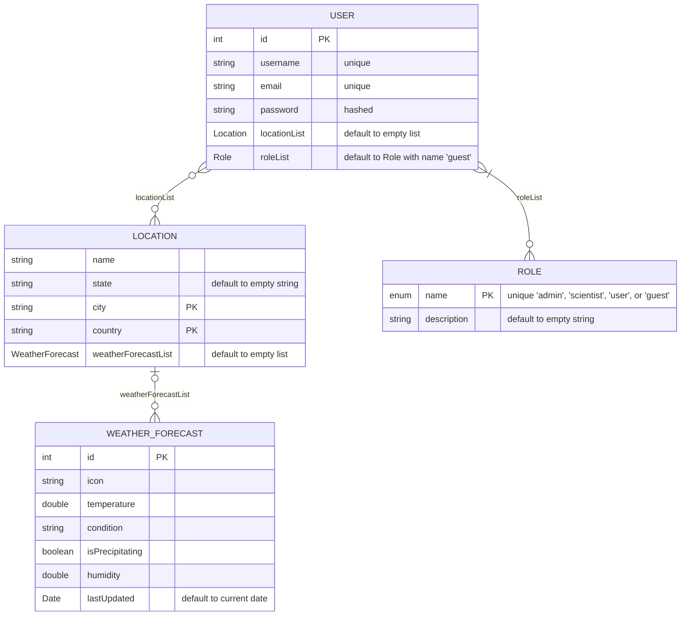

# SQL

## Run

```bash
$ docker run -d \                                                                                                                                                                                                                                                                 11:18:46
    --name weatherdb \
    -e POSTGRES_PASSWORD=mysecretpassword \
    -e PGDATA=/var/lib/postgresql/data/pgdata \
    -p 5432:5432 \
    -v $(pwd)/db:/var/lib/postgresql/data \
    postgres
```

## Diagram


